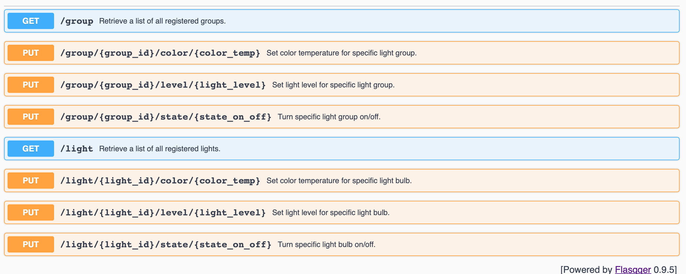

# ikea-homelight-api

## Introduction
This repo provides a simple hosted and dockerized RESTful service for programmatically manipulating IKEA Trådfri smart lights using HTTP requests from any integration point/client such as [IFTTT](https://ifttt.com/). The underlying code for interacting directly with the IKEA Trådfri Gateway is based entirely on [pytradfri](https://github.com/home-assistant-libs/pytradfri). Code from pytradfri repo has been placed in folder 'docker-baseimage' and is used as a base image to keep my work separated from theirs. Please support their great work by starring their repo.

The API exposed by this service allows you to:

* Query all light bulbs and groups registered on gateway
* Turn on/off all specific light bulbs and groups
* Set light level of all specific light bulbs and groups
* Set color temperature of all specific light bulbs and groups

## Installation & Running The Server
In order to get started you obviously need to have an IKEA Trådfri Gateway installed on your local network. You also need [Docker](https://www.docker.com/products/docker-desktop).
Before the API can work its magic, you need to create a 'tradfri_standalone_psk.conf' file (one-time-action) by cloning the [pytradfri repo](https://github.com/home-assistant-libs/pytradfri) and running the following command:

```bash
python3 -i -m pytradfri IP
```

where IP is the ip address of your gateway.

After that, place the generated file in this repo, next to 'tradfri_standalone_psk_example.conf' and build + start the docker image by running the following command:

```bash
./create-and-run-docker-image.sh 
```

If the above completed successfully, you should be able to go to http://localhost:5000/apidocs/ and you should see a nice swagger UI where you can try out the API within the browser or start calling the endpoints using curl/postman. 



In order to watch output of the web server, you can run the command:

```bash
./view-docker-container-logs.sh
```
